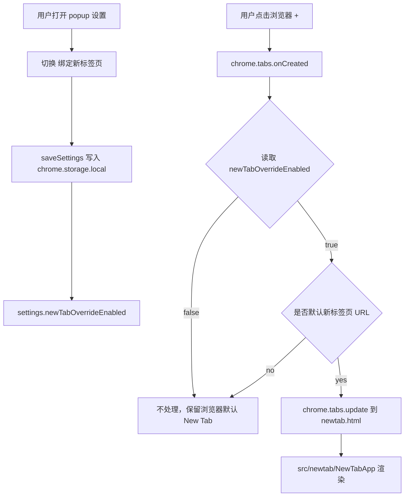
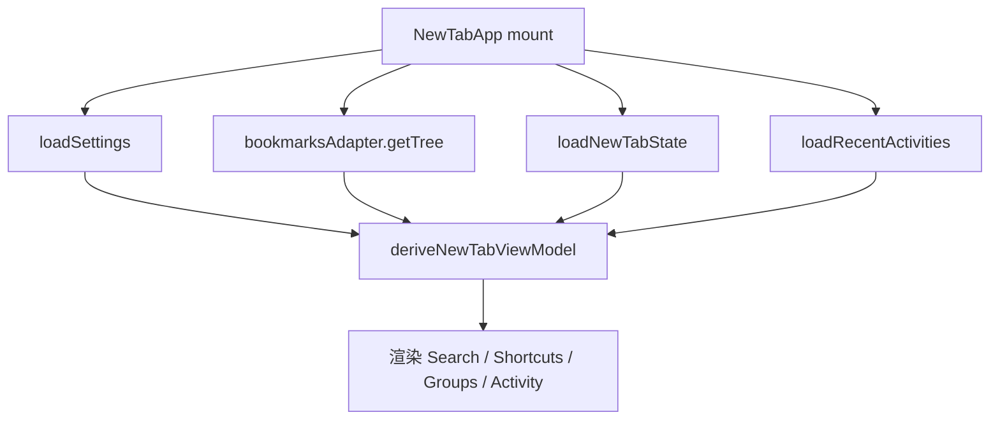
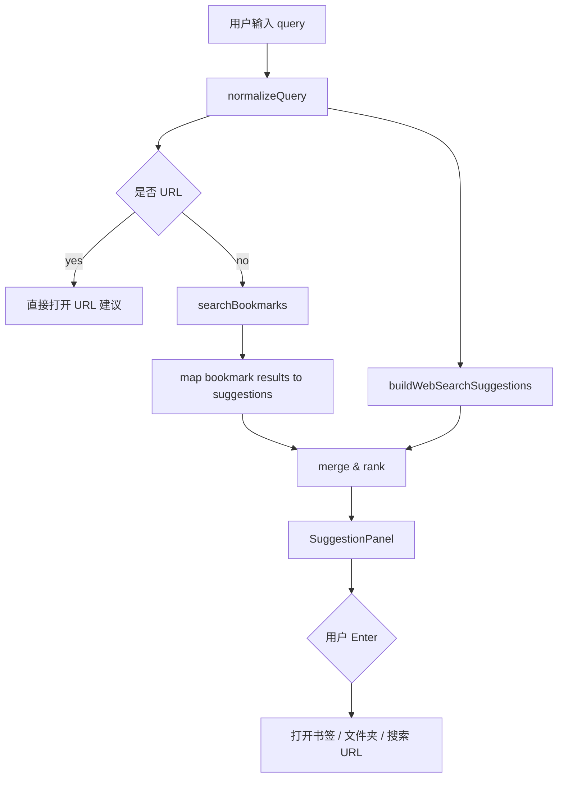
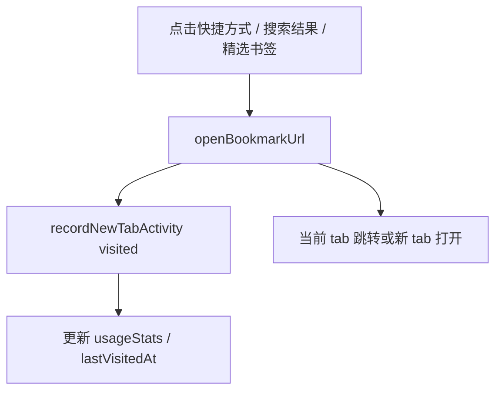

# 03. 技术架构设计

## 1. 当前架构判断

当前代码已经完成了比较清晰的分层：

```text
UI entrypoints
  src/app
  src/popup
  src/features/quick-save/content.tsx

Feature / use-case orchestration
  src/features/bookmarks
  src/features/search
  src/features/settings
  src/features/popup
  src/features/quick-save
  src/features/metadata

Infrastructure adapters
  src/lib/chrome/bookmarksAdapter.ts
  src/lib/chrome/storageAdapter.ts
  src/lib/chrome/permissionsAdapter.ts

Background
  src/background/*
```

New Tab 应沿用这个分层，不要把搜索、storage、Chrome API 直接写进 `NewTabApp.tsx`。

## 2. 新增入口

新增文件：

```text
newtab.html
src/newtab/main.tsx
src/newtab/NewTabApp.tsx
src/newtab/styles.css
src/newtab/components/*
```

`vite.config.ts` 新增 input：

```ts
input: {
  index: fileURLToPath(new URL("index.html", import.meta.url)),
  popup: fileURLToPath(new URL("popup.html", import.meta.url)),
  newtab: fileURLToPath(new URL("newtab.html", import.meta.url)),
  "service-worker": fileURLToPath(new URL("src/service-worker.ts", import.meta.url))
}
```

## 3. 新增 feature 模块

建议新增一个聚合模块 `src/features/newtab/`，内部再拆子文件，不要一次性拆太散。

```text
src/features/newtab/
  index.ts
  types.ts
  newTabState.ts
  newTabSettings.ts
  newTabViewModel.ts
  searchEngines.ts
  mixedSearch.ts
  shortcuts.ts
  activity.ts
  navigation.ts
  newTabRedirect.ts

  *.test.ts
```

职责：

| 文件 | 职责 |
|---|---|
| `types.ts` | New Tab 独有类型 |
| `newTabState.ts` | 固定快捷方式、隐藏列表、布局偏好等 local state |
| `newTabSettings.ts` | 读写设置中的 newTab 字段，可复用 settingsService |
| `newTabViewModel.ts` | 从书签树 + state + activity 派生 UI ViewModel |
| `searchEngines.ts` | 搜索引擎、分类、URL 构建 |
| `mixedSearch.ts` | 本地书签 + 网络搜索建议合并 |
| `shortcuts.ts` | 固定快捷方式派生、排序、隐藏、添加 |
| `activity.ts` | 最近活动记录读写、截断、去重 |
| `navigation.ts` | 打开 URL、打开管理页、构建 deep link |
| `newTabRedirect.ts` | service worker 中的条件重定向逻辑 |

## 4. 运行链路

### 4.1 开关绑定 New Tab



### 4.2 New Tab 页面加载



### 4.3 搜索链路



### 4.4 打开书签与记录活动



## 5. New Tab 开关技术决策

### 不推荐：manifest 静态 `chrome_url_overrides.newtab`

原因：

```text
优点：零闪烁，浏览器原生覆盖
缺点：manifest 静态声明，无法被 popup 开关真正关闭
```

### 推荐：service worker 条件重定向

原因：

```text
优点：符合用户“打开 / 关闭绑定”的需求
优点：不改变当前 manifest override 策略
优点：关闭后浏览器默认 New Tab 完全保留
缺点：可能有轻微跳转感
缺点：需要谨慎识别 chrome://newtab，避免误跳转
```

实现原则：

```text
只处理 URL 为 chrome://newtab/ 或 pendingUrl 为 chrome://newtab/ 的 tab
只在 settings.newTabOverrideEnabled === true 时处理
不处理 incognito，除非用户明确允许扩展在隐身模式运行
不处理已经是 chrome-extension://.../newtab.html 的 tab
使用一个 Set 记录正在重定向的 tabId，避免重复 update
```

## 6. 与现有模块关系

### settings

扩展 `SettingsState`，不要新建第二套全局设置系统。

```text
src/features/settings/index.ts
src/features/settings/settingsService.ts
src/features/settings/settingsService.test.ts
```

### bookmarks

复用：

```text
flattenBookmarks
flattenFolders
buildFolderPathMap
findNodeById
getDirectBookmarks
getDisplayTitle
canCreateBookmarkInFolder
```

如果 New Tab 需要文件夹卡片 ViewModel，不要在组件里递归树，放到 `newTabViewModel.ts`。

### search

短期复用 `searchBookmarks`，长期可以扩展 `SearchResult` 或新增 `searchBookmarkItems`：

```text
标题匹配
URL 匹配
路径匹配
备注匹配
最近访问加权
固定快捷方式加权
```

### popup

SettingsTab 新增开关。

```text
src/popup/tabs/SettingsTab.tsx
src/popup/PopupApp.tsx
src/popup/styles.css
```

### background

新增注册：

```text
src/background/serviceWorker.ts
  registerCommandHandlers()
  registerMessageRouter()
  registerNewTabRedirect()
```

### manifest

不增加 `chrome_url_overrides`。

`tabs` 权限当前已经存在，service worker 条件重定向可复用。保留 `bookmarks`、`storage`、`activeTab`、`scripting`、`tabs`。

## 7. 深链接设计

从 New Tab 跳转完整管理页需要能定位文件夹。

建议 URL：

```text
index.html?folderId=<id>
index.html?bookmarkId=<id>
```

需要在 `src/app/App.tsx` 或 workspace 初始化逻辑中读取 query，并在书签树加载完成后定位到对应文件夹 / 书签。

不要在 New Tab 里实现复杂编辑，复杂整理统一跳转管理页。

## 8. 长期可维护性原则

```text
1. New Tab UI 只管展示与事件，不直接调用 chrome.*
2. New Tab state 和全局 settings 分开：settings 放偏好，state 放快捷方式和使用数据
3. 搜索引擎配置纯函数化，便于测试
4. 书签树只读派生，所有真实修改继续走 bookmarksAdapter
5. 活动记录有上限，避免 chrome.storage.local 无限增长
6. MVP 不引入远程图片 favicon 依赖，避免隐私和网络失败问题
7. 不把管理页 FolderTree 搬到 New Tab，避免双端维护
```

## 9. 需要同步更新的正式文档

落地代码修改时，应同步更新：

```text
docs/adr/0002-use-new-tab-as-primary-surface.md
  保持“主界面使用 New Tab 已废弃”，但补充“New Tab 作为可选入口页重新引入”。

docs/adr/0009-use-toggleable-new-tab-redirect.md
  新增 ADR，说明为什么不用 chrome_url_overrides，而用 tabs 条件重定向。

docs/architecture/overview.md
  增加 newtab.html、service worker redirect 链路。

docs/architecture/module-boundaries.md
  增加 newtab 模块边界。

docs/product/requirements.md
  增加 New Tab 功能需求。

docs/product/interactions.md
  增加搜索、固定快捷方式、文件夹预览交互。

docs/guides/testing-and-acceptance.md
  增加 New Tab 手动验收。
```
